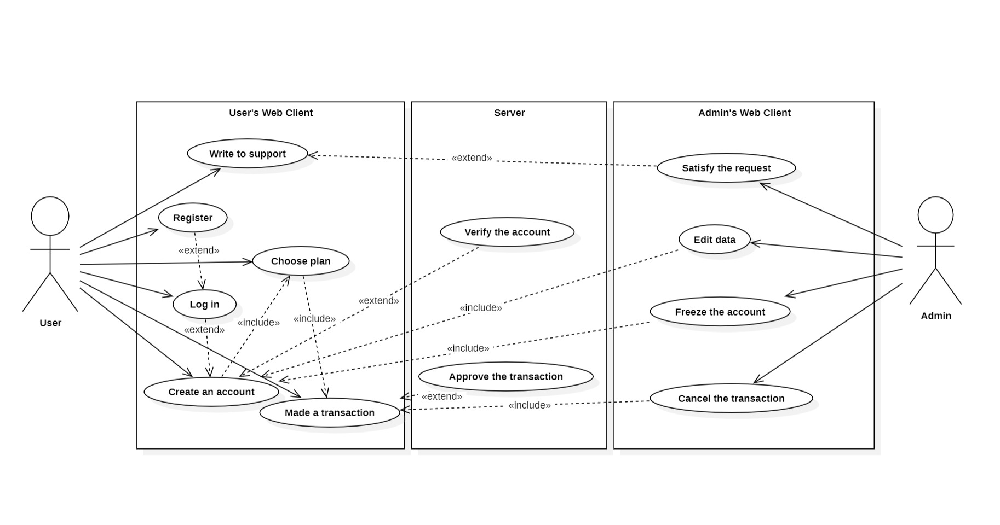

## Банковская система. Описание проекта.

#### Над проектом работали:

- Барилов Денис Б05-322
- Калинин Михаил Б05-322
- Удовенко Артём Б05-323.

### Общее описание



Проект "Банковская система" представляет собой комплексную реализацию системы для финансовых операций и управления данными клиентов и счетов в различных банках. В системе есть несколько банков, каждый из которых предоставляет финансовые услуги, такие как открытие и управление счетами, проведение транзакций и другие операции.

В основе системы лежит концепция клиентских аккаунтов (у одного пользователя может быть один аккаунт на банк) и счетов (привязанных к банку и тарифу).

Клиенты имеют персональные данные, такие как имя, фамилия, адрес и номер паспорта, которые могут быть указаны при создании учетной записи. Счета могут быть дебетовыми, кредитными или депозитными (у банков может быть по несколько тарифов одного вида).
Кроме того, предусмотрены различные действующие лица: клиенты и администраторы. Первые могут работать лишь с счетами, которые им принадлежат, а вторые - получать информацию о чем угодно, а также отменять произведенные транзакции.

### Виды счетов

| __Дебетовый счет__          | __Депозитный счет__                                                                                                                             | __Кредитный счет__                                                                                                                   |
|-----------------------------|-------------------------------------------------------------------------------------------------------------------------------------------------|--------------------------------------------------------------------------------------------------------------------------------------|
| Позволяет снимать деньги в любое время, но не позволяет уходить в минус | Предоставляет возможность хранить средства без возможности снятия до истечения срока депозита, при этом получая накопительный процент по вкладу | Имеет кредитный лимит, позволяющий клиенту уходить в минус, но влечет за собой комиссии за использование (при отрицательном остатке) |

### How2

Для запуска проекта необходимо склонировать этот репозиторий и установить соответствующие библиотеки.
Перед началом перейдите в новую пупку, в которой ходите собирать проект.\
[How2 для Windows](docs/How2/Windows.md)\
[How2 для Linux/macOS](docs/How2/Linux_macOS.md)

### Доступные страницы

Сервер запускается на [localhost](http://127.0.0.1:8000/). В данный момент реализованы следующие страницы:

- /home
- /accounts/login
- /register
- /banks
- /plans
- /persons
- /clients
- /account
- /transactions
- /admin

Для просмотра панели администратора необходимо зарегистрировать супер-пользователя.

```cmd
python manage.py createsuperuser 
```

По вопросам запуска сервера можно обращаться в любое время: [Денис](https://t.me/TWNTxygen)