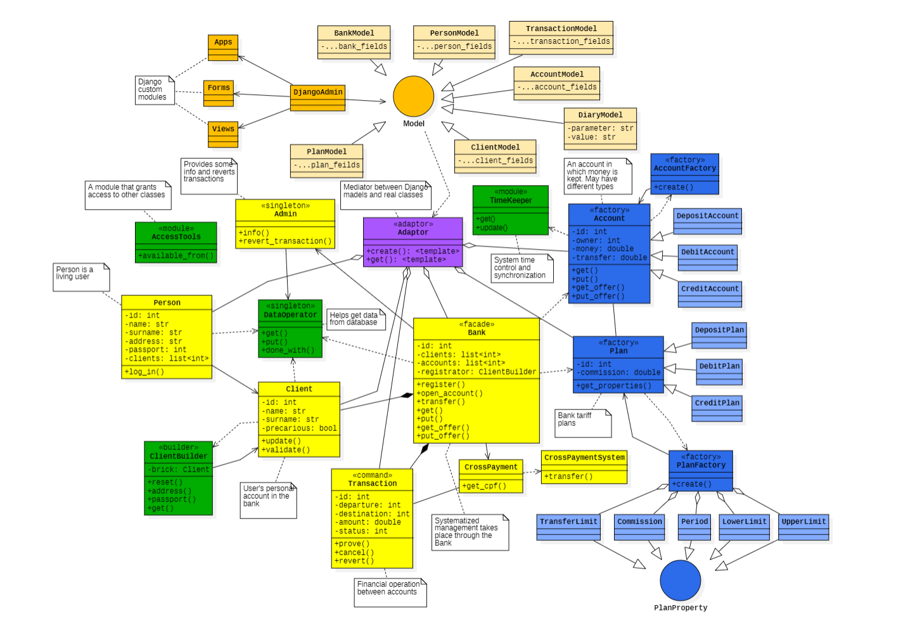

### Паттерны

Система реализована с использованием различных паттернов проектирования. В их числе:

1.	[Builder](https://en.wikipedia.org/wiki/Builder_pattern) (При создании объекта клиента)
2.	[Factory Method](https://en.wikipedia.org/wiki/Factory_method_pattern) (При создании объекта счета)
3.	[Abstract Factory](https://en.wikipedia.org/wiki/Abstract_factory_pattern) (При создании объекта плана)
4.	[Singleton](https://en.wikipedia.org/wiki/Singleton_pattern) (При взаимодействии с системой кросс-банковых)
5.	[Facade](https://en.wikipedia.org/wiki/Facade_pattern) (для упрощения взаимодействия между клиентом и банком)

### Реализация

_На диаграме отображены лишь основные классы_

Во второй итерации был произведен перенос проекта с [консольного интерфейса](../src/deprecated/user_interface.py) на web-сайт, созданный с помощью фреймворка Django.

#### Нововведения

- Подключено и настроено django-приложение
- Подключена база данных SQLite (и написаны [модели](../src/miptpaydj/mainapp/models.py))
- Написан [скрипт](../tests/sampledata.py) создания фиктивной пользовательской информации
- Страницы просмотра состояний объектов и главная страницы
- Созданы также страницы логина и регистрации
- Введена модель-абстракция User
- DO, Admin и Timekeeper переведены на singleton
- Модели и соответствующие классы связаны [адаптером](../src/operators/adaptors.py)
- [Timekeeper](../src/operators/timekeeper.py) переведен на реальные дату и время

#### Настройка временных интервалов

Предусмотрено несколько вариантов интервалов начисления процентов. Выбрать нужный режим можно в [toml файле](../pyproject.toml).